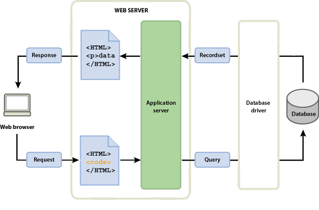

# Programación web dinámica

## Páginas web dinámicas

Las páginas web dinámicas son aquellas en las que la información presentada se genera a partir de una petición del usuario de la página.

Contrariamente a lo que ocurre con las páginas estáticas, en las que su contenido se encuentra predeterminado, en las páginas dinámicas la información aparece inmediatamente después de una solicitud echa por el usuario.

El resultado de la página obtenida en la respuesta dependerá de varios aspectos: información guardada en la base de datos, contenido de una cookie o sesión, parámetros en la petición HTTP,...

## Procesamiento de páginas dinámicas 

Cuando el servidor Web recibe una petición para mostrar una página dinámica, transfiere la página a un software especial encargado de finalizar la página. Este software especial se denomina **servidor de aplicaciones**.

El servidor de aplicaciones, según la petición que se ha realizado ejecuta un programa en un lenguaje de programación determinado y devuelve una respuesta HTTP, cuyo contenido normalmente es una página **HTML**. Esquemáticamente lo podemos ver de la siguiente manera:

## Acceso a una base de datos 

Un servidor de aplicaciones le permite trabajar con recursos del lado del servidor, como las bases de datos. Por ejemplo, una página dinámica puede indicar al servidor de aplicaciones que extraiga datos de una base de datos y los inserte en el código HTML de la página. 

El uso de una base de datos para almacenar contenido permite separar el diseño del sitio Web del contenido que se desea mostrar a los usuarios del sitio. En lugar de escribir archivos HTML individuales para cada página, sólo se necesita escribir una página —o plantilla— para presentar los datos de la base de datos al usuario. También de forma dinámica se puede presentar formularios HTML que añadan o modifiquen información en la base de datos. Esquemáticamente lo podemos ver de la siguiente manera:

## Programación web dinámica con python

Como lenguaje de programación web vamos a utilizar **Python**, como **servidor de aplicaciones** vamos a usar el concepto de **WSGI** (Web Server Gateway Interface), que es una especificación de una interface simple y universal entre los servidores web y las aplicaciones web o frameworks desarrolladas con python.

En concreto usaremos un framework python (llamado Flask) para desarrollar aplicaciones web dinámicas siguiendo el patrón de modelo-vista-controlador. Estos conceptos los estudiaremos en la siguientes unidades.